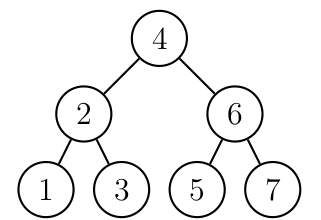

# Árvore binária de pesquisa

Uma **árvore de pesquisa** (binária) (*binary-search-tree*) é uma
estrutura de dados eficiente para armazenar informação.
Ela é particulamente adequada quando existe necessidade de considerar todos
ou alguma combinação de:
- Acesso direto e sequencial eficientes.
- Facilidade de inserção e retirada de registros.
- Boa taxa de utilização de memória.

Uma árvore binária de busca (ABB) satisfas as propriedades abaixo:
- A sub-árvore da esquerda possui apenas nós menores do que o nó raiz
- A sub-árvore da direita possui apenas nós maiores do que o nó raiz
- As sub-árvores da esquerda e direita também devem ser árvores ABB (definição recursiva)

A **altura** de um nó é o comprimento do caminho mais longo deste nó até um
nó folha.
A altura de uma árvore é a altura do nó raiz.

A figura abaixo ilustra um exemplo de uma árvore de busca binária.



Um código exemplo está disponível no arquivo [abb.cpp](abb.cpp) como o
uso de templates C++:
```C++
template<typename T>
struct Arvore {
    T dado;
    Arvore<T>* esq;
    Arvore<T>* dir;

	// restante do código ...
};
```

## Busca 

Os passos na operação de `busca` para uma chave `x` são:
- Compare com a chave que está na raiz.
- Se $x$ é menor, vá para a sub-árvore esquerda.
- Se $x$ é maior, vá para a sub-árvore direita.
- Repita o processo recursivamente, até que a chave procurada seja
encontrada ou um nó folha é atingido.


O algoritmo de busca em árvore binária é ilustrado abaixo:
```C++
Arv* ArvBusca( Arv* a, int chave ) {
	if( a == NULL )        return NULL;
	if( a.chave == chave)  return a;
	if( chave < a.chave )  return ArvBusca( a->esq, chave );
	else                   return ArvBusca( a->dir, chave );
	return NULL;
}
```

## Inserção e remoção

O procedimento de `inserção` é:
- Executar o procedimento de busca da chave a ser inserida.
- O ponto onde deveria estar a chave é o ponto de inserção.

O procedimento de `remoção` não é tão simples:
- Executar o procedimento de busca da chave a ser removida.
- Se o nó contém o registro a ser removido possui no máximo
um descendente, trocar o nó a ser removido pelo seu descendente.
- Se possuir dois descendentes o registro a ser removido deve ser primeiro
substituído:
	- pelo registro mais à direita na sub-árvore esquerda.
	- ou pelo registro mais à esquerda na sub-árvore direita.

## Percursos

Podemos percorrer uma ABB de três formas: pré-ordem, em-ordem, e pós-ordem.
- **Percurso Pré-ordem** - visitar a raiz, percorrer a sua sub-árvore esquerda em pré-ordem, e percorrer a sua sub-árvore direita em pré-ordem.
- **Percurso Em-ordem** - percorrer a sua sub-árvore esquerda em em-ordem, visitar a raiz, percorrer a sua sub-árvore direita em em-ordem.
- **Percurso Pós-ordem** -  percorrer sua sub-árvore esquerda em pós-ordem, percorrer sua sub-árvore direita em pós-ordem, visitar a raiz.

## Propriedades de ABBs


Dada a notação:
- $n$ - número de nós.
- $e$ - número de nós externos (folhas).
- $i$ - número de nós internos (não folhas).
- $h$ - altura.

Segue as seguintes propriedades sobre árvores binárias:
- $e = i + 1$.
- $n = 2e - 1$.
- $h \leq i$.
- $h \leq (n-1)/2$.
- $e \leq 2^h$.
- $h \geq \log e$.
- $ \geq \log (n+1) -1$.

## Análise

O número de comparações em uma busca com sucesso no melhor caso é 
$C(n)= 1$, pior caso $C(n) = n$ e caso médio $C(n) = \log  n$.
O pior caso ocorre quando as chaves são inseridas em ordem crescente ou decrescente.
