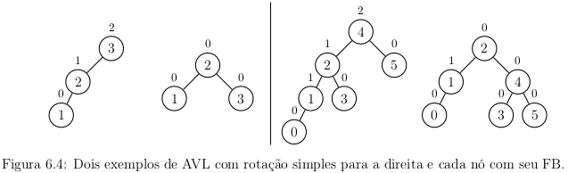
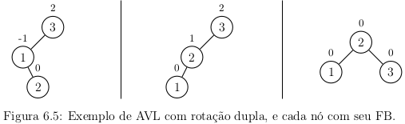
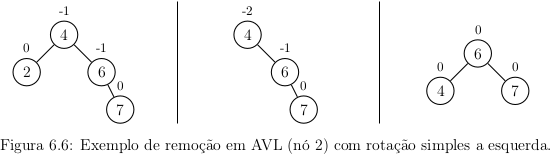

# Árvores de busca balanceadas

Uma limitação das árvores binárias de pesquisa é a ordem em que os elementos
são inseridos. Por exemplo, as ordens de inserção abaixo:
- ordem `1, 2, 3, 4, 5, 6, 7` gera uma **árvore degenerada** (todo nó
tem apenas um filho).
- ordem `4, 6, 2, 5, 1, 7, 3` gera uma árvore binária completa.
O que afeta diretamente o desempenho na busca de elementos.

Idealmente deseja-se que a árvore esteja **completamente balanceada**.
A distância média para qualquer nó da árvore é mínima.
No entanto, manter uma árvore completamente balanceada tem alto custo.
Uma solução é procurar uma solução intermediária que possa manter a árvore
balanceada.

Uma **árvore de busca balanceada** garante uma altura de $O(\log n)$
quando implementa um conjunto dinâmico de $n$ itens.
Alguns exemplos de árvores balanceadas são AVL, árvores 2-3, árvores 2-3-4,
B-trees e árvore rubro-negra.

## Árvore AVL

Uma árvore binária é denominada **AVL** (dos seus criadores Georgy
Adelson-Velsky e Landis) se para todos os nós, **as alturas de suas duas
sub-árvores diferem no máximo em uma unidade**, sendo assim balanceada.
Operações de consulta, inserção e remoção de nós tem custo $O(\log n)$.

O **fator de balanceamento** (FB) de um nó é a diferença entre
a altura da sub-árvore da esquerda e a altura da sub-árvore da direita.
Se não existir uma sub-árvore, a altura é zero.
Os resultados de um FB são:
- Maior que zero ($> 0$) - sub-árvore da direita é menor.
- Menor que zero ($< 0$) - sub-árvore da esquerda é menor.
- Igual a zero ($= 0$) - sub-árvores tem a mesma altura.

Os valores válidos de FB são $-1$ (sub-árvore da esquerda é menor), $0$, $1$
(sub-árvore da direita é menor).

## Inserção

O nó é inserido como em uma árvore binária comum.
Se a inserção não degenerar a árvore, o processo termina.
Caso contrário, é necessário:
- Encontrar o nó cujo FB esteja fora do intervalo (pivô).
- Realizar uma rotação na árvore a partir do nó *pivô* (rotação simples ou rotação dupla).

Apenas uma rotação (simples ou dupla) é necessária.
Após essa rotação, a árvore já estará balanceada.
Há quatro possibilidades de rotação:
- 2 casos externos (direita e esquerda) com rotação simples.
- 2 casos internos (direta e esquerda) com rotação dupla.

## Rotação

Suponha que $\alpha$ seja um pivô, nos casos externos, uma rotação simples é necessária 
caso a inserção ocorra na *sub-árvore à esquerda do filho à esquerda de* $\alpha$
ou na *sub-árvore à direita do filho à direita de* $\alpha$.
A figura abaixo demonstra dois exemplos de rotação
simples a direta.

Nos casos internos, suponha que o pivô seja $\alpha$, 
uma rotação dupla é necessária caso a inserção ocorra 
na *sub-árvore à esquerda do filho à direita de* $\alpha$ ou
na *sub-árvore à direita do filho à esquerda de* $\alpha$.
Uma rotação dupla equivale a duas rotações simples em sequência.
A figura abaixo demonstra um exemplo de rotação
dupla a direta.

## Remoção

A remoção em AVL é similar a inserções, mas mais complexas.
Incialmente, usa-se a estratégia de remoção das árvores não balanceadas.
Porém, pode gerar desequilíbrio e exigir balanceamento.
Rotações simples e duplas são necessárias durante esse balanceamento.

Após o balanceamento, pode haver desequilíbrio em níveis superiores.
Assim, deve-ser analisar também esses níveis superiores.
A figura demonstra um exemplo de remoção
com rotação simples a esquerda.

## Análise

Entre as possíveis operações temos:
- **Rotação** única custo $O(1)$ pois é constante.
- **Busca**  é $O(\log n)$ pois a altura de árvore é $O(\log n)$
e não necessita balanceamento.
- **Inserção** é $O(\log n)$ com o custo da busca incial de $O(\log n)$
e mais balanceamento para manter FP tem custo $O(\log n)$.
- **Remoção** é $O(\log n)$ com a busca inicial de $O(\log n)$ mais
balanceamento para manter FP tem custo $O(\log n)$.
